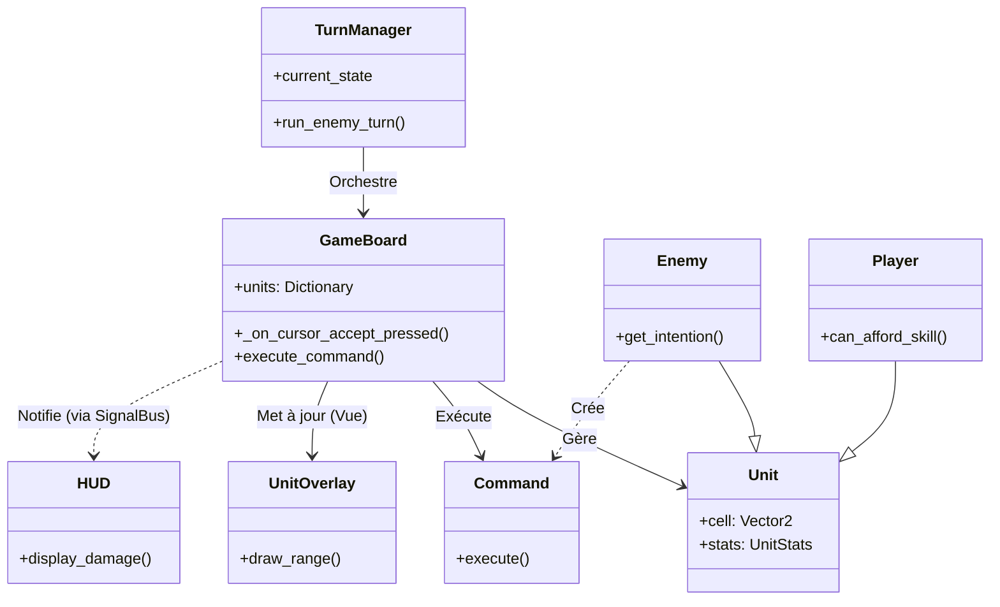

# État du Développement - Architecture MVC

Ce document présente une vue d'ensemble de votre projet actuel structurée selon le modèle **MVC (Modèle-Vue-Contrôleur)**. Cela vous permet de visualiser clairement la séparation des responsabilités et l'état d'avancement de chaque partie.

## 1. Modèle (Model)
*Ce qui représente les données, l'état du jeu et la logique métier pure.*

### Entités & Logique
*   **`unit/unit.gd`** : Classe de base définissant l'état d'une unité (position, vie, références).
*   **`unit/Enemy/enemy.gd`** : Étend `Unit`. Contient la logique décisionnelle de l'IA (`get_intention`).
*   **`unit/Player/player.gd`** : Étend `Unit`. Contient la logique spécifique au joueur (gestion des ressources de compétences).
*   **`environment/level.gd`** : Données concernant le niveau (points de spawn, structure).

### Données (Resources)
*   **`unit/ressourses/unit_stats.gd`** : Structure de données pour les statistiques (PV, Force, etc.).
*   **`unit/ressourses/skills/skills_data.gd`** : Structure de données définissant les compétences (portée, coût, dégâts).
*   **`Grid`** (impliqué dans `game_board.gd`) : Représentation mathématique de la grille (coordonnées).

---

## 2. Vue (View)
*Ce qui est affiché à l'écran et ce que l'utilisateur voit.*

### Interface Utilisateur (UI)
*   **`UI/hud.gd`** & **`GameRoot.tscn`** : Affichage tête haute (dégâts flottants, etc.).
*   **`UI/game_over.gd`** : Écran de fin de partie.
*   **`UI/amount_visual.gd`** : Affichage visuel des quantités (dégâts/soins).
*   **`UI/skill_bar.gd`** : Barre de compétences (visuel).

### Rendu du Jeu
*   **`unit/unit_visual.gd`** : Gère les sprites et les animations des unités.
*   **`unit/unit_overlay.gd`** : Gère le feedback visuel sur la grille (portée de déplacement, zone d'impact des sorts).
*   **`unit/unit_path.gd`** : Affiche le chemin que l'unité va emprunter.
*   **`environment/levels/level_01.tscn`** : La scène visuelle du niveau (TileMap).

---

## 3. Contrôleur (Controller)
*Ce qui gère les entrées, la logique de déroulement et la communication entre le Modèle et la Vue.*

### Orchestration
*   **`gamemanager/turn_manager.gd`** : Le "Cerveau" temporel. Gère la machine à états des tours (`PLAYER`, `ENEMY`, `BUSY`). Il décide *quand* les choses se passent.
*   **`gamemanager/game_board.gd`** : Le chef d'orchestre central. Il :
    *   Reçoit les entrées du joueur (clics souris).
    *   Convertit les clics en coordonnées de grille.
    *   Délègue l'exécution aux Commandes.
    *   Fait le lien entre les Unités (Modèle) et l'Overlay (Vue).

### Actions (Command Pattern)
*   **`Commands/command.gd`** (Interface)
*   **`Commands/moveCommand.gd`** : Logique de déplacement.
*   **`Commands/attackCommand.gd`** : Logique de combat.
*   **`Commands/healCommand.gd`**, **`waitCommand.gd`**, **`buffCommand.gd`**.

---

## Diagramme des Relations

## Résumé de l'Avancement

### ✅ Ce qui est en place (Solide)
1.  **Boucle de Jeu (Core Loop) :** Le `TurnManager` gère bien l'alternance Joueur/Ennemis.
2.  **Système d'Actions :** Le pattern *Command* est bien implémenté, permettant d'ajouter facilement de nouvelles actions (Sorts, Objets).
3.  **Architecture Modulaire :** La séparation entre la logique (`Enemy`), les données (`Stats`) et le visuel (`UnitVisual`) est propre.

### 🚧 Pistes pour la suite (Suggestions)
1.  **Menu Principal :** Il semble manquer une scène de menu principal (`MainMenu.tscn`) pour lancer le jeu.
2.  **Gestionnaire de Progression :** Un système pour passer d'un niveau à l'autre (Level Manager) au-delà du `level_01`.
3.  **Inventaire / UI Complexe :** Si le jeu doit avoir un inventaire, il faudra ajouter les Vues et Contrôleurs correspondants dans `UI/`.
